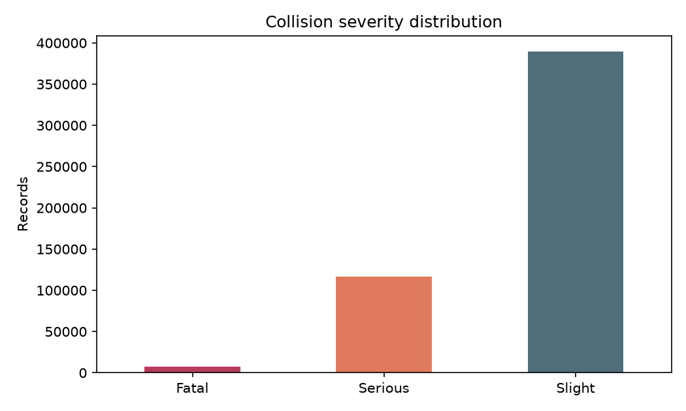
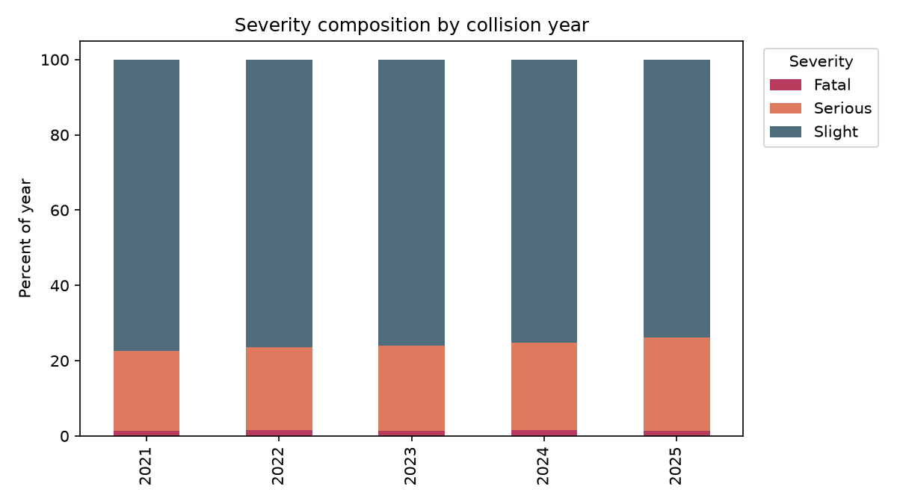
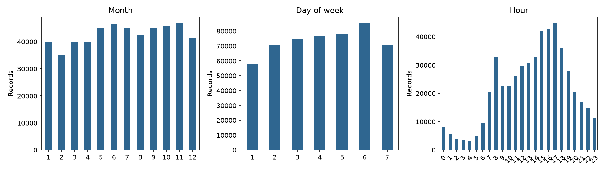
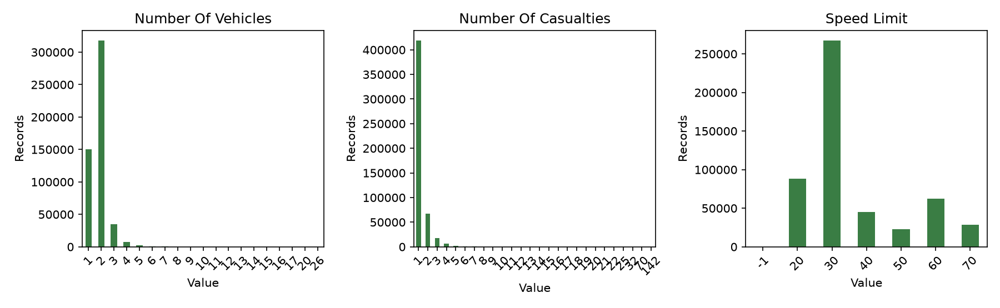
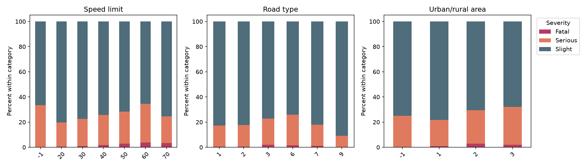

# DATA UNDERSTANDING

Audit deskriptif full dataset dilakukan pada 2026-08-27 menggunakan `data/raw/dft-road-casualty-statistics-collision-last-5-years.csv`. Analisis ini tidak melakukan sampling 10K, balancing, preprocessing permanen, atau pemodelan. Angka dan pola di bawah adalah deskripsi dataset, bukan hubungan kausal.

## 1. Dataset Overview

### FACT

| Item                         |                                                           Verified result |
| ---------------------------- | ------------------------------------------------------------------------: |
| Records                      |                                                                   513,801 |
| Columns                      |                                                                        44 |
| File size                    |                                                          97,669,586 bytes |
| Date period                  |                                                  2021-01-01 to 2025-12-31 |
| Years                        | 2021: 101,087; 2022: 106,004; 2023: 104,258; 2024: 100,927; 2025: 101,525 |
| Full-row duplicates          |                                                                         0 |
| `collision_index` duplicates |                                                                         0 |
| Target                       |                                                      `collision_severity` |
| Target missing               |                                                                         0 |
| Target codes                 |                                                                   1, 2, 3 |

The 10,000-record dataset remains a legacy baseline and is not used as the Phase 2 analysis dataset.

### INTERPRETATION

The full dataset is large enough to describe year-to-year variation without reducing it to the historical 10K baseline. Its in-memory footprint was approximately 208.11 MB with pandas' loaded dtypes, so later analyses should avoid unnecessary dataframe copies.

## 2. Dataset Structure

### FACT

The complete 44-column inventory is:

```text
collision_index, collision_year, collision_ref_no,
location_easting_osgr, location_northing_osgr, longitude, latitude,
police_force, collision_severity, number_of_vehicles, number_of_casualties,
date, day_of_week, time, local_authority_district,
local_authority_ons_district, local_authority_highway,
local_authority_highway_current, first_road_class, first_road_number,
road_type, speed_limit, junction_detail_historic, junction_detail,
junction_control, second_road_class, second_road_number,
pedestrian_crossing_human_control_historic,
pedestrian_crossing_physical_facilities_historic, pedestrian_crossing,
light_conditions, weather_conditions, road_surface_conditions,
special_conditions_at_site, carriageway_hazards_historic,
carriageway_hazards, urban_or_rural_area,
did_police_officer_attend_scene_of_accident, trunk_road_flag,
lsoa_of_accident_location, enhanced_severity_collision,
collision_injury_based, collision_adjusted_severity_serious,
collision_adjusted_severity_slight
```

Loaded source dtypes were 30 `int64`, 8 string columns, and 6 `float64` columns. Derived understanding fields used only for this audit were `month` from `date` and `hour` from `time`; they were not written into the raw dataset.

### INTERPRETATION

The schema mixes identifiers, administrative/geographic codes, temporal fields, road/environment fields, and outcome-derived fields. Numeric storage does not by itself mean that a code is a continuous measurement.

## 3. Target Distribution

### FACT

| Code | Label   | Records |  Percent |
| ---: | ------- | ------: | -------: |
|    1 | Fatal   |   7,553 |  1.4700% |
|    2 | Serious | 116,813 | 22.7351% |
|    3 | Slight  | 389,435 | 75.7949% |



Target composition by year:

| Year | Fatal | Serious | Slight |   Total |
| ---: | ----: | ------: | -----: | ------: |
| 2021 | 1.46% |  21.06% | 77.49% | 101,087 |
| 2022 | 1.51% |  22.01% | 76.48% | 106,004 |
| 2023 | 1.46% |  22.48% | 76.06% | 104,258 |
| 2024 | 1.49% |  23.35% | 75.16% | 100,927 |
| 2025 | 1.43% |  24.81% | 73.76% | 101,525 |



### INTERPRETATION

The target is strongly imbalanced. The descriptive share of Serious records rises each year, while Slight declines; Fatal remains close to 1.4–1.5% of each year. This is a temporal distribution pattern, not evidence of a cause.

## 4. Temporal Analysis

### FACT

The date and time fields parsed successfully using `%d/%m/%Y` and `%H:%M`. Derived frequency peaks were:

| Dimension | Highest observed volume | Lowest observed volume |
| --------- | ----------------------- | ---------------------- |
| Month     | November: 46,835        | February: 35,179       |
| Day code  | 6: 85,311               | 1: 57,781              |
| Hour      | 16: 42,895              | 04: 3,138              |

The broad hourly peak is 16–17 (42,895 and 44,792 records). The broad low period is 02–05. The exact weekday labels for codes 1–7 require the official data dictionary and are therefore not inferred here.



### INTERPRETATION

Accident records are not evenly distributed over month, day code, or hour. The time fields are useful candidates for descriptive analysis and later modeling review, but these frequencies do not establish why accidents occur.

## 5. Numerical Feature Analysis

### FACT

The following numeric summaries cover measurement-like fields and potentially useful count fields. Latitude/longitude and OSGR coordinates have 53 missing values each.

| Feature                  |   Count |        Mean |    Median |         Std |    Min |      Q1 |         Q3 |       Max |  IQR indication |
| ------------------------ | ------: | ----------: | --------: | ----------: | -----: | ------: | ---------: | --------: | --------------: |
| `number_of_vehicles`     | 513,801 |       1.824 |         2 |       0.688 |      1 |       1 |          2 |        26 |  10,227 (1.99%) |
| `number_of_casualties`   | 513,801 |       1.271 |         1 |       0.726 |      1 |       1 |          1 |       142 | 95,003 (18.49%) |
| `speed_limit`            | 513,801 |      35.900 |        30 |      14.371 |     -1 |      30 |         40 |        70 | 90,964 (17.70%) |
| `latitude`               | 513,748 |      52.366 |    51.843 |       1.312 | 49.912 |  51.462 |     53.334 |    60.500 |             N/A |
| `longitude`              | 513,748 |      -1.211 |    -1.107 |       1.355 | -7.487 |  -2.111 |     -0.133 |     1.760 |             N/A |
| `location_easting_osgr`  | 513,748 | 454,945.487 | 460,443.5 |  92,658.539 | 67,564 | 392,630 | 529,549.25 |   655,345 |             N/A |
| `location_northing_osgr` | 513,748 | 275,427.620 | 217,372.5 | 145,647.350 | 10,211 | 175,147 |    382,395 | 1,179,892 |             N/A |



The IQR figures are screening indications only. They flag values outside the conventional $[Q1 - 1.5IQR, Q3 + 1.5IQR]$ rule and do not prove data errors. `speed_limit=-1` is a sentinel-like value and must not be interpreted as a physical speed limit without codebook handling.

## 6. Categorical Feature Analysis

### FACT

Selected category counts and dominant observed codes are shown below. Codes are retained as codes because the local mapping is incomplete for several fields.

| Feature                   | Categories | Dominant observed categories                      |
| ------------------------- | ---------: | ------------------------------------------------- |
| `road_type`               |          6 | 6: 373,065; 3: 76,119; 1: 31,178                  |
| `speed_limit`             |          7 | 30: 267,325; 20: 88,096; 60: 62,703               |
| `junction_detail`         |          8 | 0: 252,021; 13: 142,597; 16: 47,572; `-1`: 19,982 |
| `junction_control`        |          6 | 4: 222,569; `-1`: 217,897; 2: 56,431              |
| `light_conditions`        |          6 | 1: 368,193; 4: 105,834; 6: 27,438                 |
| `weather_conditions`      |         10 | 1: 413,632; 2: 55,834; 8: 15,955                  |
| `road_surface_conditions` |          7 | 1: 374,268; 2: 120,572; 9: 6,721; `-1`: 3,527     |
| `urban_or_rural_area`     |          4 | 1: 345,314; 2: 168,429; 3: 50; `-1`: 8            |

Rare categories are present, including `urban_or_rural_area=3` (50 records), `weather_conditions=6` (238 records), and several high values of `number_of_vehicles` with fewer than 100 records. No categories were merged or removed in this phase.

### INTERPRETATION

The categorical fields are unevenly distributed and include explicit sentinel values. One-hot encoding or numeric scaling decisions should wait until code meanings, cardinality, and generalization risks are reviewed.

## 7. Missing Value Analysis

### FACT

Only four source columns contain pandas-missing values:

| Feature                  | Missing | Percent |
| ------------------------ | ------: | ------: |
| `location_easting_osgr`  |      53 | 0.0103% |
| `location_northing_osgr` |      53 | 0.0103% |
| `longitude`              |      53 | 0.0103% |
| `latitude`               |      53 | 0.0103% |

The target and all temporal fields have zero pandas-missing values. Sentinel `-1` values are separate from pandas missingness; examples include `junction_control` (217,897), `junction_detail` (19,982), and `road_surface_conditions` (3,527).

### INTERPRETATION

The explicit missingness is small and concentrated in geographic fields. It should not automatically justify row deletion. If geographic features are retained, the four coordinate fields should be treated as one missingness pattern and one representation should be selected; if they are excluded, the exclusion should be documented consistently.

## 8. Data Quality Findings

### Strengths — FACT

- Full dataset has 513,801 records and all 44 expected columns.
- There are 0 full-row duplicates and 0 duplicate `collision_index` values.
- Date and time parsing succeeded for every record.
- Target has no missing values and only the three expected codes.

### Problems — FACT

- Target is highly imbalanced: Fatal is 1.47%.
- Four geographic columns each contain 53 missing values.
- Sentinel codes occur in multiple categorical/code fields.
- Several categories and high count values are rare.

### Potential Risks — INTERPRETATION

- Outcome-derived and adjusted severity columns can leak target information.
- Administrative and geographic identifiers may act as proxies, have high cardinality, or generalize poorly across years.
- `number_of_casualties` is recorded after the collision and may be unavailable in a pre-event use case.
- The official meanings of some codes are not available in the local mapping file.

### Recommended Preparation — RECOMMENDATION

- Obtain and cite the official STATS19 codebook before decoding or grouping unresolved codes.
- Define the prediction timing before deciding whether post-event fields are allowed.
- Keep missingness handling inside the eventual training pipeline; do not delete the 53 coordinate-missing records automatically.
- Preserve class proportions in evaluation and report per-class and macro metrics.

## 9. Feature Roles

This is an initial role classification, not final feature selection.

| Role              | Initial fields                                                                                                                                                                                                                                                                                                                                        |
| ----------------- | ----------------------------------------------------------------------------------------------------------------------------------------------------------------------------------------------------------------------------------------------------------------------------------------------------------------------------------------------------- |
| Identifier        | `collision_index`, `collision_ref_no`                                                                                                                                                                                                                                                                                                                 |
| Target            | `collision_severity`                                                                                                                                                                                                                                                                                                                                  |
| Temporal          | `collision_year`, `date`, `day_of_week`, `time`; derived `month`, `hour` for analysis                                                                                                                                                                                                                                                                 |
| Numeric/count     | `number_of_vehicles`, `number_of_casualties`, `speed_limit`                                                                                                                                                                                                                                                                                           |
| Categorical/code  | `police_force`, `first_road_class`, `road_type`, `junction_detail`, `junction_control`, `second_road_class`, `pedestrian_crossing`, `light_conditions`, `weather_conditions`, `road_surface_conditions`, `special_conditions_at_site`, `carriageway_hazards`, `urban_or_rural_area`, `did_police_officer_attend_scene_of_accident`, `trunk_road_flag` |
| Geographic        | `location_easting_osgr`, `location_northing_osgr`, `longitude`, `latitude`, `lsoa_of_accident_location`                                                                                                                                                                                                                                               |
| Administrative    | `local_authority_district`, `local_authority_ons_district`, `local_authority_highway`, `local_authority_highway_current`, `police_force`                                                                                                                                                                                                              |
| Potential leakage | `number_of_casualties`, `enhanced_severity_collision`, `collision_injury_based`, `collision_adjusted_severity_serious`, `collision_adjusted_severity_slight`, and conditionally police attendance                                                                                                                                                     |
| Review required   | Historical fields, road-number fields, administrative/geographic fields, `number_of_vehicles`, and all unresolved code fields                                                                                                                                                                                                                         |

Historical fields are listed for review because their role and relationship to current fields need domain confirmation; this table does not make a final drop decision beyond the leakage concerns already documented in the strategy.

## 10. Target vs Important Features

### FACT

Descriptive within-category target compositions show visible differences:

| Feature               | Example observed composition                                                                   |
| --------------------- | ---------------------------------------------------------------------------------------------- |
| `speed_limit`         | Fatal: 0.47% at 20, 0.87% at 30, 3.84% at 60; Serious: 19.19%, 21.78%, 30.65% respectively     |
| `road_type`           | Slight ranges from 74.06% for code 6 to 91.01% for code 9; category sizes differ substantially |
| `urban_or_rural_area` | Fatal: 0.80% for code 1 and 2.83% for code 2; code 3 has only 50 records                       |
| `number_of_vehicles`  | Fatal is 2.24% for one vehicle and 0.96% for two vehicles; high counts are very sparse         |
| `hour`                | Fatal is 0.79% at 08:00 and 4.11% at 04:00; the 04:00 category contains only 3,138 records     |
| `month`               | Slight ranges from 73.82% in August to 77.21% in January                                       |
| `day_of_week`         | Fatal ranges from 1.25% for code 3 to 1.95% for code 1                                         |



### INTERPRETATION

There are descriptive differences between severity composition and several road, time, and context categories. Sparse categories can produce unstable percentages, so category size must accompany every comparison. These results do not establish causal effects and do not justify final feature selection.

## 11. Data Mining Relevance

- **Classification:** Most directly aligned with the labeled `collision_severity` target. Class imbalance, leakage control, and prediction timing must be resolved before modeling.
- **Clustering:** Potentially useful for descriptive grouping of collision contexts when the target and leakage fields are excluded. It requires careful encoding and scaling decisions; no clustering is performed in Phase 2.
- **Association:** Potentially useful for co-occurring road, environment, and temporal codes. It would require categorical transformation and support/confidence thresholds; it is not a current focus.
- **Prediction/Forecasting:** Relevant only after defining a time-based question such as future-year generalization or aggregate accident volume. The current row-level target is classification, not a forecasting target.
- **Description/pattern discovery:** Strongly relevant now: distributions, temporal profiles, missingness, category concentration, and target composition provide the main Phase 2 output.

## 12. CRISP-DM Position

| CRISP-DM stage         | Current status                                                                                          |
| ---------------------- | ------------------------------------------------------------------------------------------------------- |
| Business Understanding | PARTIAL — case is known; prediction timing and assessment objective remain open                         |
| Data Understanding     | COMPLETED for Phase 2 — full schema, quality, distributions, roles, and descriptive patterns documented |
| Data Preparation       | PARTIAL — strategy exists; no final transformation implemented                                          |
| Modeling               | NOT STARTED for full dataset                                                                            |
| Evaluation             | NOT STARTED for full dataset                                                                            |
| Deployment             | PARTIAL — legacy Streamlit application exists but is not a full-dataset Tugas 2 result                  |

## 13. Key Findings

1. The full dataset is complete at 513,801 rows by 44 columns, with no full-row duplicates.
2. `collision_severity` is highly imbalanced, and the Serious share rises descriptively across 2021–2025.
3. Time distributions are concentrated around daytime and late afternoon, with lower volume overnight.
4. Code fields are dominated by a few categories but contain sentinel and rare values that need codebook-aware handling.
5. Target composition differs descriptively across speed limit, road type, urban/rural code, vehicle count, and time fields.
6. Geographic missingness is minimal in percentage terms but concentrated across all four coordinate representations.

## 14. Risks

- Class imbalance can hide poor Fatal-class performance.
- Outcome-derived fields can cause severe leakage.
- Sparse categories can make apparent target differences unstable.
- Geographic and administrative fields can encode location-specific or temporal proxies.
- Local mappings do not cover every code field, so semantic interpretation remains incomplete.

## 15. Recommendations for Data Preparation

1. Confirm the official STATS19 data dictionary and code meanings.
2. Confirm prediction timing and then freeze an availability-based leakage exclusion list.
3. Create derived temporal features inside a reproducible pipeline, not by modifying the raw CSV.
4. Decide whether geographic representation is allowed; retain one representation if approved and handle its 53-record missing pattern in-pipeline.
5. Treat sentinel codes explicitly and keep rare-category counts visible during preparation.
6. Use a documented temporal holdout if future-year generalization is the objective; otherwise document the approved alternative.
7. Plan imbalance-aware evaluation before any resampling or class weighting experiment.

## 16. Open Questions

1. Is the target use case pre-event, at-scene, or post-event prediction?
2. Which STATS19 codebook version should define every unresolved code?
3. Are geographic and administrative features allowed by the assignment and acceptable for generalization/privacy?
4. Should 2025 be reserved as the final temporal test year?
5. Which data-mining roles are mandatory in the assessment, versus optional extensions?

## 17. Next Phase

**PHASE 3 – DATA PREPARATION:** use these verified findings to define the approved feature contract, leakage exclusions, code decoding, temporal derivations, missing-value treatment, and reproducible train/test data preparation. Do not begin modeling, balancing, tuning, PCA, association mining, or deployment in this phase transition.
